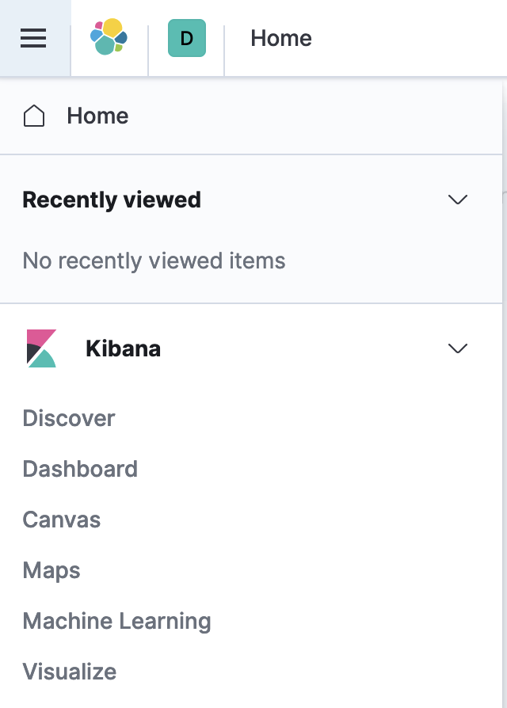
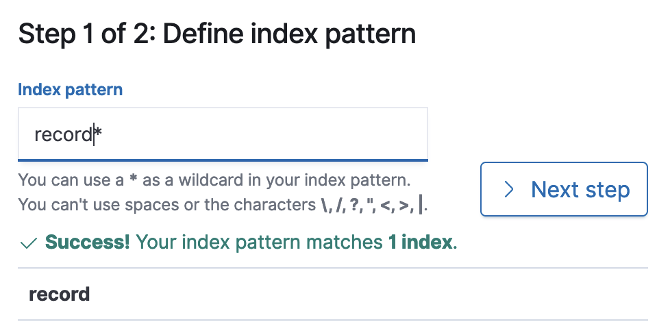
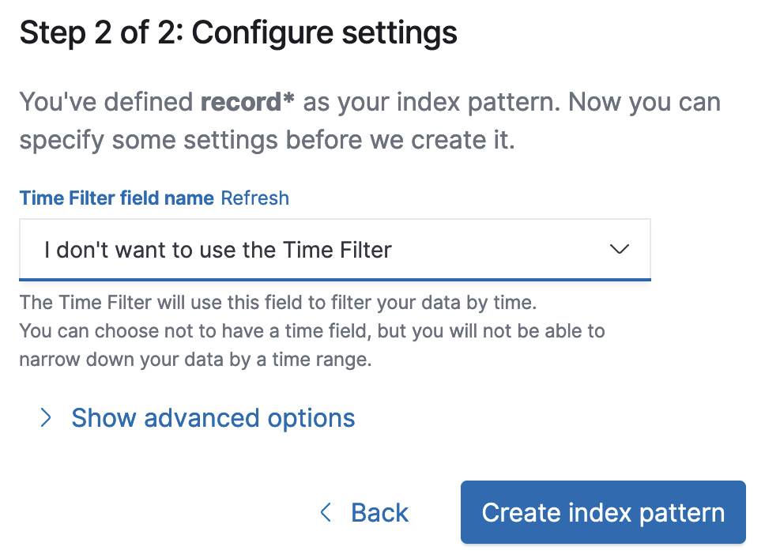
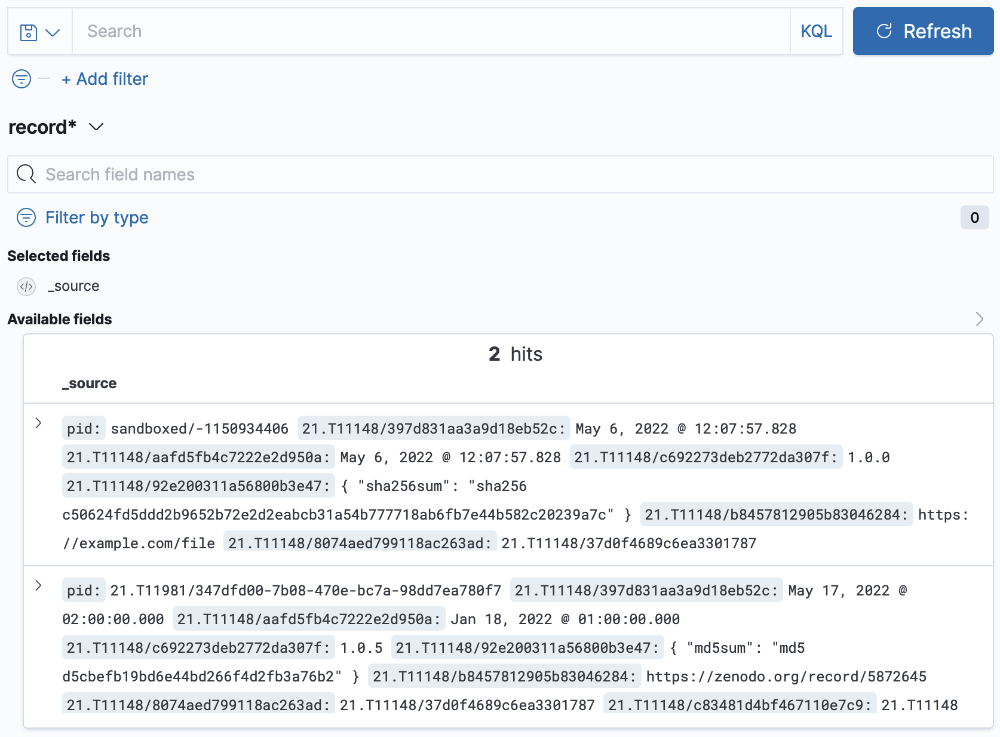

# {{ page.title }}

The FAIR DO Lab contains user interfaces to demonstrate the services. Not all of them are meant for production.

## Kibana

Kibana can be used to explore the database, but is being considered a management interface. It is not a simple interface for everyday search requests that should be accessible to all users. Kibana is available via <http://127.0.0.1:5601>.

- Click on discover in the left-side menu.

    {:class="max-h-96"}

- Set `record*` as the index pattern.

    {:class="max-h-52"}

- You can not set a time filter or choose not to.

    {:class="max-h-52"}

- Click on Discover again (see first image)

- View and search through your PIDs.

    {:class="max-h-96"}